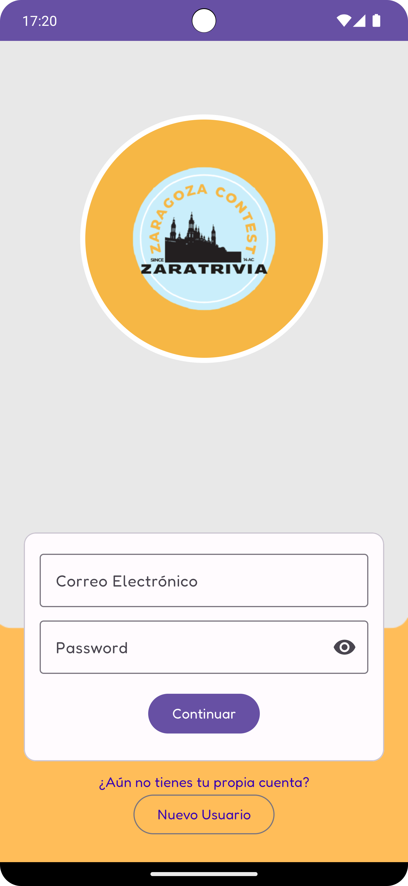
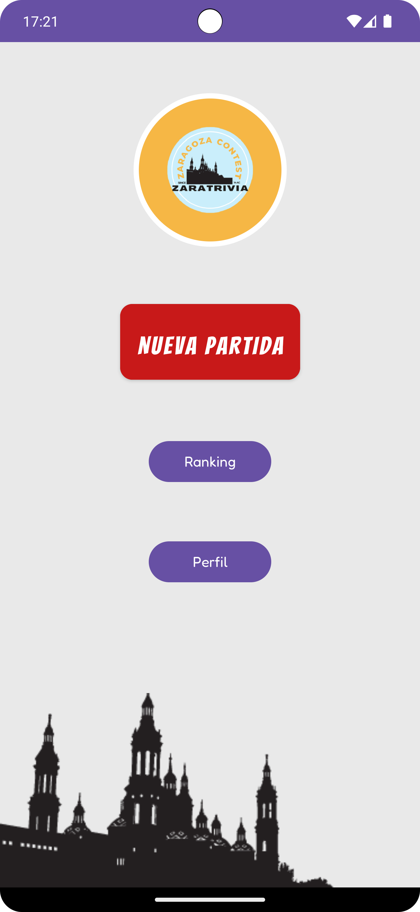
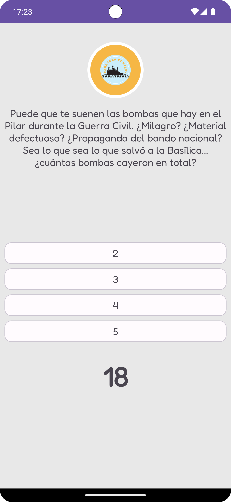
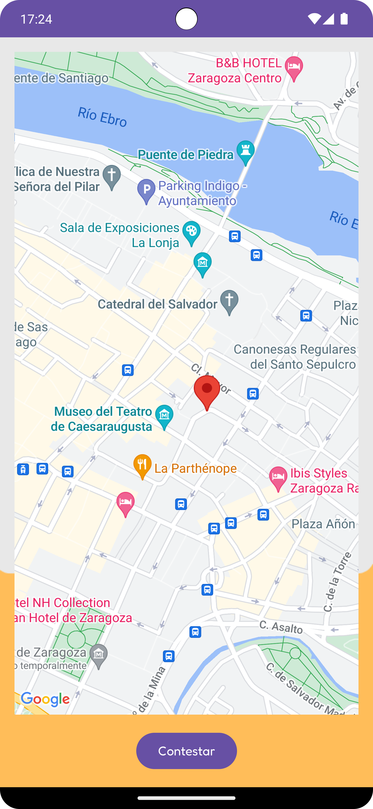
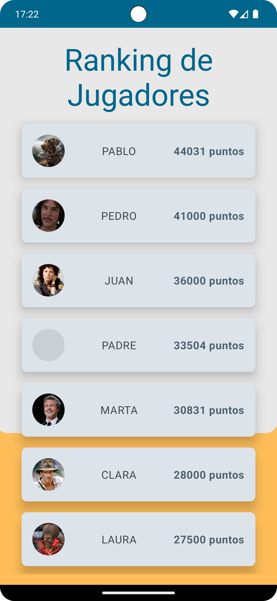
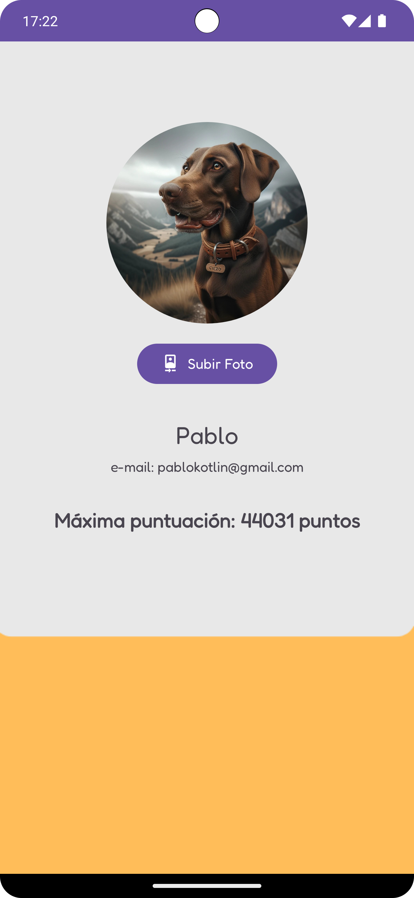

# ZaraTrivia

  

## Descripción General

ZaraTrivia es una aplicación diseñada con una **Arquitectura Clean** y que se adhiere a los **principios SOLID**, lo que garantiza un código organizado y mantenible. La experiencia de usuario está enriquecida con interfaces desarrolladas con **Jetpack Compose** en algunas de sus vistas, autenticación y almacenamiento de datos gestionados por **Firebase**, y pantallas que integran el **SDK de Google Maps** para ubicar puntos de interés en la ciudad.

Esta aplicación pondrá a prueba los conocimientos sobre la ciudad de Zaragoza a través de un juego de preguntas y respuestas. Cada respuesta correcta nos llevará un paso más cerca de convertirse en un experto de su historia, mientras se disfruta de un diseño atractivo y una navegación intuitiva.

## Features

- **Preguntas Dinámicas**: Una amplia variedad de preguntas que se actualizan regularmente.
- **Puntuación por Tiempo**: Los usuarios obtienen más puntos cuanto más rápido responden.
- **Ronda de Bonus en el Mapa**: Utiliza Google Maps para una experiencia interactiva.
- **Autenticación de Usuarios**: Ingreso seguro a través de Firebase.
- **Tabla de Puntuaciones**: Tablas de clasificación para fomentar la competencia amistosa entre los usuarios.
- **Diseño Responsivo**: Optimizada para una variedad de dispositivos móviles.

## Capturas de pantalla

  
  
  
  
  
  

## Estructura del Proyecto

La aplicación ZaraTrivia sigue una **Arquitectura Clean** y **principios SOLID**, y está organizada dentro de la carpeta `src/main/java/`:

- `data/` - Contiene las implementaciones concretas de la lógica de acceso a datos, separadas en fuentes de datos remotas y locales.
  - `question/` - Operaciones relacionadas con las preguntas del trivia.
    - `remote/` - Implementación específicas para la comunicación con servicios remotos (Firebase).
  - `score/` - Operaciones relacionadas con el manejo de puntuaciones.
    - `remote/` - Implementación específicas para la comunicación con servicios remotos (Firebase).
    - `storage/` - Implementación para el almacenamiento local, usando Shared Preferences.
  - `user/` - Operaciones relacionadas con la información de los usuarios.
    - `remote/` - Implementación específicas para la comunicación con servicios remotos (Firebase).
    - `storage/` - Implementación para el almacenamiento local, usando Shared Preferences.
- `di/` - Configuración de la inyección de dependencias para la aplicación, utilizando Koin.
- `domain/` - Contiene los casos de uso y la lógica de negocio, asegurando la separación de la lógica de la aplicación y la UI.
  - `usecase/` - Casos de uso específicos para manejar las acciones del usuario y la comunicación con el repositorio de datos.
  - `repository/` - Interfaces de los repositorios que abstraen el origen de los datos.
- `model/` - Definiciones de los objetos de dominio que representan las entidades del negocio.
- `ui/` - Todos los componentes de la interfaz de usuario, organizados por funcionalidad y pantallas.
  - `common/` - Componentes de UI compartidos y utilizados en varias partes de la aplicación.
  - `fragment/` - Fragmentos que representan las distintas vistas.
  - `viewmodel/` - ViewModels que siguen el patrón MVVM, proporcionando los datos y la lógica para las vistas.
- `ContestApplication.kt` - Punto de entrada de la aplicación y de inyección de dependencias.

## Librerías y herramientas utilizadas

La aplicación hace uso de una serie de librerías y herramientas para asegurar una arquitectura robusta, un código limpio y una experiencia de usuario fluida. A continuación, se listan algunas de las más destacadas:

- **Jetpack Compose**: Para construir interfaces de usuario con un enfoque declarativo y moderno.
- **Firebase**: Utilizada para la autenticación de usuarios y el almacenamiento de datos en la nube.
- **Google Maps SDK**: Para integrar mapas interactivos en la ronda de bonus de la aplicación.
- **Koin**: Como framework ligero de inyección de dependencias que facilita el manejo de la construcción y el suministro de dependencias.
- **Android Navigation Component**: Para definir una navegación clara y consistente entre los diferentes fragmentos de la aplicación.
- **ViewBinding**: Para interactuar con las vistas de una manera segura y eficiente, evitando errores comunes como null pointer exception.
- **Retrofit**: Para manejar las peticiones HTTP y la comunicación con APIs para datos remotos.
- **Coroutines de Kotlin**: Para gestionar la asincronía y la concurrencia en Kotlin de forma más sencilla y legible.

Estas herramientas y librerías son fundamentales para el funcionamiento de la app y han sido seleccionadas para cumplir con sus requisitos de y adherirse a las mejores prácticas de desarrollo de software.

## Instalación

Sigue estos pasos para configurar el entorno de desarrollo y ejecutar la aplicación:

### Clona el repositorio de GitHub

git clone <https://github.com/pablo-ziura/zaragoza-contest.git>

### Configura Firebase

Para integrar Firebase en tu proyecto, sigue estos pasos:

1. Accede a la [Consola de Firebase](https://console.firebase.google.com/) y crea un nuevo proyecto si no tienes uno.
2. Sigue las instrucciones para agregar una aplicación Android al proyecto de Firebase.
3. Descarga el archivo `google-services.json` y colócalo en el directorio `app/` de tu proyecto.

### Obtén una API Key para Google Maps SDK

Para usar Google Maps SDK, necesitas una clave de API:

1. Visita la [Consola de Google Cloud](https://console.cloud.google.com/) y selecciona o crea un proyecto.
2. Navega a la sección de credenciales y genera una nueva clave de API para la aplicación.
3. Restringe el uso de la clave de API como corresponda para mejorar la seguridad y guárdala en los recursos del proyecto tal y como se especifica en la [documentación de Google Maps](https://developers.google.com/maps/documentation/android-sdk/get-api-key).

## Play Store

Puedes instalar y ejecutar la aplicación desde la Play Store: [Ficha Play Store](https://play.google.com/store/apps/details?id=com.zaragoza.contest)

## Licencia

Este proyecto está licenciado bajo la Licencia MIT - ver el archivo [LICENSE.md](LICENSE.md) para detalles.
